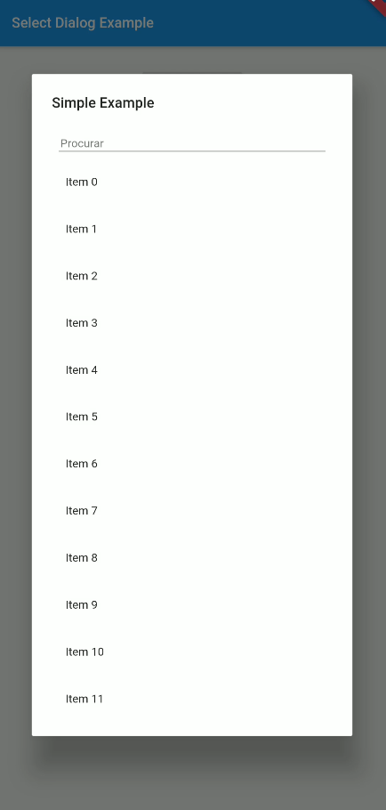
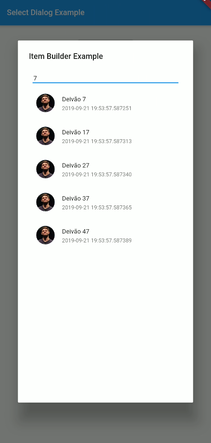

# select_dialog Package

Package designed to select an item from a list, with the option to filter and even search the items online.

 

## pubspec.yaml
```yaml
select_dialog: <last version>
```

## import
```dart
import 'package:select_dialog/select_dialog.dart';
```

## simple example
```dart
String ex1 = "No value selected";

SelectDialog.showModal<String>(
  context,
  label: "Simple Example",
  selectedValue: ex1,
  items: List.generate(50, (index) => "Item $index"),
  onChange: (String selected) {
    setState(() {
      ex1 = selected;
    });
  },
);
```

## Getting Started

This project is a starting point for a Dart
[package](https://flutter.dev/developing-packages/),
a library module containing code that can be shared easily across
multiple Flutter or Dart projects.

For help getting started with Flutter, view our 
[online documentation](https://flutter.dev/docs), which offers tutorials, 
samples, guidance on mobile development, and a full API reference.
